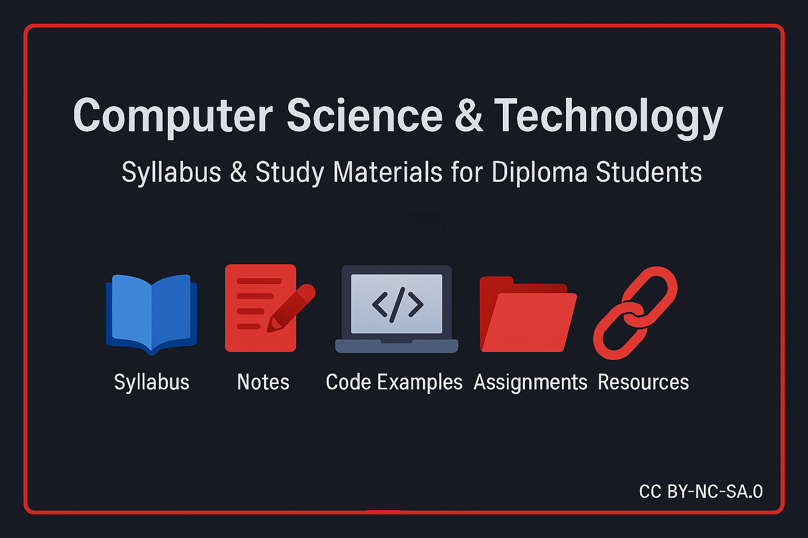

<p align="center">
  
</p>

# Computer Science & Technology — Syllabus & Study Materials

[]()
[]()
[]()

> This repository has been created to collect and organize all syllabus, notes, practice codes, and study resources related to Computer Science & Technology at the Diploma level.


---

## Table of Contents
1. [Overview](#overview)
2. [Contents (Highlights)](#contents-highlights)
3. [How to Use](#how-to-use)
4. [License](#license)
5. [Contact](#contact)
6. [Disclaimer](#disclaimer)

---

## Overview
- **Purpose:** To make learning faster and easier with simple, practical, and step-by-step notes and code.
- **For:** Students of Diploma / Beginners in Computer Science.
- **Language:** English (with the option to add Bengali if required).

---

## Contents (Highlights)
- **Syllabus** — Diploma syllabus collected here.
- **Notes** — Clear and practical notes with examples and common questions.
- **Code examples** — Hands-on code for practice.
- **Assignments & Practice** — Small projects and exercises.
- **Resources** — Books, websites, and YouTube tutorials.

---

## How to Use
1. Clone the repository:
   ```bash
   git clone https://github.com/sagar900aj/Computer-science-and-technology.git
   cd Computer-science-and-technology

---

## License

This educational material is licensed under **Creative Commons Attribution-NonCommercial-ShareAlike 4.0 International (CC BY-NC-SA 4.0)**.

You are free to share and adapt the material for non-commercial purposes, as long as you provide attribution and distribute your contributions under the same license.

See [LICENSE](LICENSE) for full terms.

---

## Contact

- GitHub: [sagar900aj](https://github.com/sagar900aj)  
- Email:  sagar900aj@gmail.com

---


## Disclaimer

The content in this repository is for **educational purposes only**. While every effort is made to ensure the accuracy of notes, syllabus, and code examples, the actual syllabus and requirements may differ across different colleges, boards, and institutions. Students should always verify with their **official syllabus and guidelines**.

---


## 🔗 Share this Repository
<p align="left">
  <a href="https://www.facebook.com/sharer/sharer.php?u=https://github.com/sagar900aj/Computer-science-and-technology" target="_blank" rel="noopener">
    
  </a>
  &nbsp;&nbsp;
  <a href="https://api.whatsapp.com/send?text=Check%20this%20out%20-%20Computer%20Science%20%26%20Technology%20https://github.com/sagar900aj/Computer-science-and-technology" target="_blank" rel="noopener">
    
  </a>
  &nbsp;&nbsp;
  <a href="https://t.me/share/url?url=https://github.com/sagar900aj/Computer-science-and-technology&text=Computer%20Science%20%26%20Technology%20Repo" target="_blank" rel="noopener">
    
  </a>
  &nbsp;&nbsp;
  <a href="https://www.linkedin.com/sharing/share-offsite/?url=https://github.com/sagar900aj/Computer-science-and-technology" target="_blank" rel="noopener">
    
  </a>
  &nbsp;&nbsp;
  <a href="mailto:?subject=Computer%20Science%20%26%20Technology%20Repo&body=Check%20this%20out%20https://github.com/sagar900aj/Computer-science-and-technology" target="_blank" rel="noopener">
    
  </a>
</p>


If you find this repository helpful, feel free to share it with your friends and classmates!  

📘 **Repo Link:**  
👉 [Computer Science & Technology — Syllabus & Study Materials](https://github.com/sagar900aj/Computer-science-and-technology)

1. Copy this repository link :
   ```bash
    https://github.com/sagar900aj/Computer-science-and-technology.git

⭐ Don’t forget to **star** this repo — it helps others discover it!


---

---

<p align="center">
  ⚡ Powered by late nights, coffee ☕︎, and study sessions ❤  
  <br/>
  — <b>Sagar</b>
</p>

---
---
