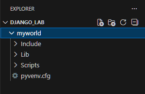
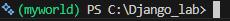
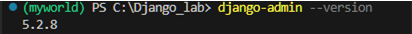
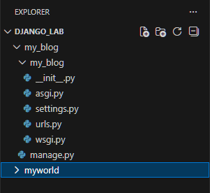
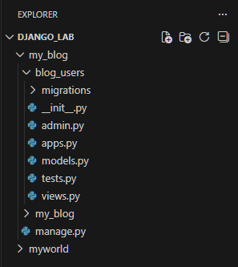
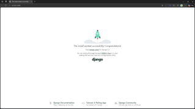
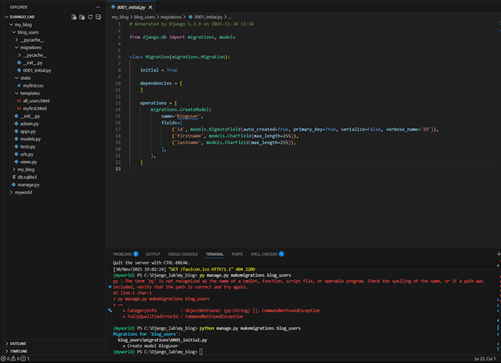
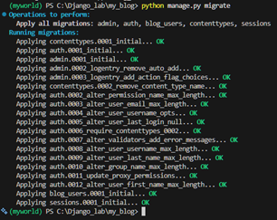
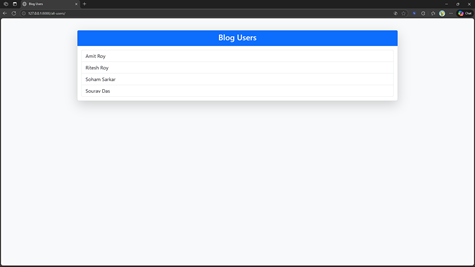

# Django Setup & Simple App — Lab Copy


<p align="center">
  <strong>Lab Experiment: Django Installation & Blog Users Application</strong>
</p>

---

## 📋 Lab Details

| Field | Details |
|-------|---------|
| **Name** | Sagar Maity |
| **Roll No.** | 120 |
| **Date** | 30.11.25 |
| **Experiment** | Install Django, create project & app, templates, static files, model, migrate, display data |

 [`Full project`](/Django_lab) 
---

## 🎯 Objective

Install Django in a virtual environment, create a project and app, render templates and static files, create a model, add data, and display it on the frontend.

---

## 🛠 Environment & Tools

- **OS:** Windows
- **Python:** ≥ 3.x
- **Tools Required:** pip, venv
- **Framework:** Django
- **Frontend:** HTML5 + Bootstrap 5.3.3
- **Database:** SQLite (Default)

---

## 📦 Step-by-Step Setup Guide

### **Step 1: Create Virtual Environment**

```powershell
cd C:\path\to\workfolder
python -m venv myworld
```

**Output:** A `myworld` folder is created in your working directory.



---

### **Step 2: Activate Virtual Environment**

**On PowerShell:**

```powershell
myworld\Scripts\Activate.ps1
```

**Note:** If you get an execution policy error, run:

```powershell
Set-ExecutionPolicy -ExecutionPolicy RemoteSigned -Scope CurrentUser
```

**After activation, your prompt should look like:**

```powershell
(myworld) C:\path\to\workfolder\>
```



---

### **Step 3: Install Django**

```powershell
(myworld) python -m pip install Django
```

---

### **Step 4: Check Django Version**

```powershell
(myworld) django-admin --version
```

**Expected Output:** `5.1.1` (or your installed version)



---

### **Step 5: Create Django Project**

```powershell
(myworld) django-admin startproject my_blog
cd my_blog
```

**Project structure created:**

```
my_blog/
├── manage.py
├── my_blog/
│   ├── __init__.py
│   ├── settings.py
│   ├── urls.py
│   ├── asgi.py
│   └── wsgi.py
└── db.sqlite3
```



---

### **Step 6: Create Django App (blog_users)**

```powershell
(myworld) python manage.py startapp blog_users
```

**App structure created:**

```
blog_users/
├── migrations/
│   └── __init__.py
├── __init__.py
├── admin.py
├── apps.py
├── models.py
├── tests.py
├── urls.py (create manually)
└── views.py
```



---

### **Step 7: Run Server (Test)**

```powershell
(myworld) python manage.py runserver
```

**Open browser:** `http://127.0.0.1:8000/`

You should see the Django welcome page.

**Stop server:** Press `Ctrl+C`



---

## 📝 Code Files to Create/Edit

### **A — `blog_users/views.py`**

Create two views: one for testing, one to display database records.

```python
from django.http import HttpResponse
from django.template import loader
from .models import Bloguser

def blog_users(request):
    """Simple test view"""
    return HttpResponse("Hello world!")

def members(request):
    """Display all blog users from database"""
    myusers = Bloguser.objects.all().values()
    template = loader.get_template('all_users.html')
    context = {'myusers': myusers}
    return HttpResponse(template.render(context, request))
```

---

### **B — Create `blog_users/urls.py`**

Create a new file `urls.py` in the `blog_users` app:

```python
from django.urls import path
from . import views

urlpatterns = [
    path('blog-users/', views.blog_users, name='blog-users'),
    path('all-users/', views.members, name='all-users'),
]
```

---

### **C — Edit `my_blog/urls.py` (Project URLs)**

Update the main project URLs to include the app routes:

```python
from django.contrib import admin
from django.urls import include, path

urlpatterns = [
    path('', include('blog_users.urls')),
    path('admin/', admin.site.urls),
]
```

**Comment:** This registers all app routes and the admin interface.

---

### **D — Create `blog_users/templates/myfirst.html`**

Create the `templates` folder inside `blog_users/`, then create `myfirst.html`:

```html

<!DOCTYPE html>
<html lang="en">
<head>
  <meta charset="utf-8">
  <title>My First Django</title>

  <!-- Bootstrap CSS -->
  <link 
    href="https://cdn.jsdelivr.net/npm/bootstrap@5.3.3/dist/css/bootstrap.min.css" 
    rel="stylesheet" 
    integrity="sha384-QWTKZyjpPEjISv5WaRU9OFeRpok6YctnYmDr5pNlyT2bRjXh0JMhjY6hW+ALEwIH" 
    crossorigin="anonymous">

  <!-- Custom CSS -->
  <link rel="stylesheet" href="">
</head>

<body class="bg-light">

  <div class="container py-5">
      <div class="card shadow-lg p-4">
          <h1 class="text-center text-primary">Hello World!</h1>
          <p class="text-center fs-4">Welcome to my first Django project!</p>
      </div>
  </div>

  <!-- Bootstrap JavaScript -->
  <script 
    src="https://cdn.jsdelivr.net/npm/bootstrap@5.3.3/dist/js/bootstrap.bundle.min.js" 
    integrity="sha384-YvpcrYf0tY3lHB60NNkmXc5s9fDVZLESaAA55NDzOxhy9GkcIdslK1eN7N6jIeHz" 
    crossorigin="anonymous">
  </script>

</body>
</html>
```

---

### **E — Create `blog_users/templates/all_users.html`**

Display all blog users from the database:

```html
<!DOCTYPE html>
<html lang="en">
<head>
    <meta charset="UTF-8">
    <title>Blog Users</title>

    <!-- Bootstrap CSS -->
    <link 
        href="https://cdn.jsdelivr.net/npm/bootstrap@5.3.3/dist/css/bootstrap.min.css" 
        rel="stylesheet" 
        integrity="sha384-QWTKZyjpPEjISv5WaRU9OFeRpok6YctnYmDr5pNlyT2bRjXh0JMhjY6hW+ALEwIH"
        crossorigin="anonymous">
</head>

<body class="bg-light">

<div class="container py-5">
    <div class="card shadow-lg">
        <div class="card-header bg-primary text-white text-center">
            <h2>Blog Users</h2>
        </div>

        <div class="card-body">
            <ul class="list-group">
                
                    <li class="list-group-item fs-5">
                        {{ x.firstname }} {{ x.lastname }}
                    </li>
                
                    <li class="list-group-item text-danger">No users found.</li>
                
            </ul>
        </div>
    </div>
</div>

<!-- Bootstrap JS -->
<script 
    src="https://cdn.jsdelivr.net/npm/bootstrap@5.3.3/dist/js/bootstrap.bundle.min.js"
    integrity="sha384-YvpcrYf0tY3lHB60NNkmXc5s9fDVZLESaAA55NDzOxhy9GkcIdslK1eN7N6jIeHz"
    crossorigin="anonymous">
</script>

</body>
</html>
```

---

### **F — Create `blog_users/static/myfirst.css`**

Create a `static` folder inside `blog_users/`, then create `myfirst.css`:

```css
body {
  background-color: lightblue;
  font-family: verdana;
  color: #333;
}

.card {
  border-radius: 10px;
}

.card-header {
  border-radius: 10px 10px 0 0;
}

.list-group-item {
  border: 1px solid #dee2e6;
  padding: 12px;
  transition: background-color 0.3s ease;
}

.list-group-item:hover {
  background-color: #e7f3ff;
}
```

---

### **G — Create Model in `blog_users/models.py`**

Define the `Bloguser` model:

```python
from django.db import models

class Bloguser(models.Model):
    firstname = models.CharField(max_length=255)
    lastname = models.CharField(max_length=255)

    def __str__(self):
        return f"{self.firstname} {self.lastname}"

    class Meta:
        verbose_name = "Blog User"
        verbose_name_plural = "Blog Users"
```

---

### **H — Register App in `my_blog/settings.py`**

Add `'blog_users'` to the `INSTALLED_APPS` list:

```python
INSTALLED_APPS = [
    'django.contrib.admin',
    'django.contrib.auth',
    'django.contrib.contenttypes',
    'django.contrib.sessions',
    'django.contrib.messages',
    'django.contrib.staticfiles',
    'blog_users',  # <-- Add this line
]
```


---

## 🗄 Database Setup: Migrations & Adding Data

### **Step 1: Make Migrations**

```powershell
(myworld) python manage.py makemigrations blog_users
```

**Expected Output:**

```
Migrations for 'blog_users':
  blog_users/migrations/0001_initial.py
    - Create model Bloguser
```



---

### **Step 2: Apply Migrations**

```powershell
(myworld) python manage.py migrate
```

**Expected Output:**

```
Operations to perform:
  Apply all migrations: admin, auth, contenttypes, sessions, blog_users
Running migrations:
  Applying blog_users.0001_initial... OK
```



---

### **Step 3: Add Records Using Django Shell**

Open Django shell:

```powershell
(myworld) python manage.py shell
```

**Inside the shell, add records:**

```python
from blog_users.models import Bloguser

# Add single user
bloguser = Bloguser(firstname='Amit', lastname='Roy')
bloguser.save()

# Add multiple users
b1 = Bloguser(firstname='Ritesh', lastname='Roy')
b2 = Bloguser(firstname='Soham', lastname='Sarkar')
b3 = Bloguser(firstname='Sourav', lastname='Das')

for b in (b1, b2, b3):
    b.save()

# Verify all users
print(Bloguser.objects.all().values())

# Exit shell
exit()
```


---

### **Step 4: Run Server & View Users List**

```powershell
(myworld) python manage.py runserver
```

**Open browser:** `http://127.0.0.1:8000/all-users/`

You should see the list of blog users displayed beautifully with Bootstrap styling!



---

## 🔐 Admin Panel: Add Data Via Web Interface

### **Step 1: Register Model in Admin**

Edit `blog_users/admin.py`:

```python
from django.contrib import admin
from .models import Bloguser

@admin.register(Bloguser)
class BloguserAdmin(admin.ModelAdmin):
    list_display = ('firstname', 'lastname')
    search_fields = ('firstname', 'lastname')
```

---

### **Step 2: Create Superuser**

```powershell
(myworld) python manage.py createsuperuser
```

**Follow the prompts:**

```
Username: admin
Email: admin@example.com
Password: ••••••••
Password (again): ••••••••
Superuser created successfully.
```


---

### **Step 3: Access Admin Panel**

Run server:

```powershell
(myworld) python manage.py runserver
```

**Open browser:** `http://127.0.0.1:8000/admin/`

Login with superuser credentials.


---

### **Step 4: Add Users Via Admin**

1. Click **"Blogusers"** in the admin panel
2. Click **"Add Bloguser"**
3. Enter `firstname` and `lastname`
4. Click **"Save"**


---

## 📂 Project Structure

```
my_blog/
├── manage.py
├── db.sqlite3
├── my_blog/
│   ├── __init__.py
│   ├── settings.py (INSTALLED_APPS updated)
│   ├── urls.py (include blog_users.urls)
│   ├── asgi.py
│   └── wsgi.py
└── blog_users/
    ├── migrations/
    │   ├── __init__.py
    │   └── 0001_initial.py
    ├── templates/
    │   ├── myfirst.html
    │   └── all_users.html
    ├── static/
    │   └── myfirst.css
    ├── __init__.py
    ├── admin.py (Bloguser registered)
    ├── apps.py
    ├── models.py (Bloguser model defined)
    ├── tests.py
    ├── urls.py (URL patterns)
    └── views.py (blog_users & members views)
```

---

## 🚀 Quick Start Commands Summary

```powershell
# 1. Create and activate virtual environment
python -m venv myworld
myworld\Scripts\Activate.ps1

# 2. Install Django
pip install Django

# 3. Create project and app
django-admin startproject my_blog
cd my_blog
python manage.py startapp blog_users

# 4. Create migrations
python manage.py makemigrations blog_users
python manage.py migrate

# 5. Create superuser
python manage.py createsuperuser

# 6. Run server
python manage.py runserver

# 7. Access application
# http://127.0.0.1:8000/all-users/
# http://127.0.0.1:8000/admin/
```

---

## ✅ Expected Output

| URL | Output |
|-----|--------|
| `http://127.0.0.1:8000/blog-users/` | "Hello world!" |
| `http://127.0.0.1:8000/all-users/` | List of blog users in a styled table |
| `http://127.0.0.1:8000/admin/` | Django admin panel |

---

## 📚 Additional Notes

- **Template Tag ``:** Required to use static files (CSS, JS, images)
- **Django ORM:** `.objects.all()` fetches all records; `.values()` returns dictionaries
- **Bootstrap 5.3.3:** CDN links are used; no local installation needed
- **SQLite Database:** Default database; located in `db.sqlite3`
- **Admin Customization:** Use `@admin.register()` decorator or `admin.site.register()` method

---

## 📞 Troubleshooting

| Issue | Solution |
|-------|----------|
| "Port 8000 already in use" | Use `python manage.py runserver 8001` |
| "Template not found" | Ensure `templates` folder exists in the app directory |
| "Static files not loading" | Run `python manage.py collectstatic` |
| "Migration error" | Delete `db.sqlite3` and `migrations/` folder (except `__init__.py`), then re-migrate |

---

## 🎓 Learning Outcomes

✅ Understand Django project structure  
✅ Create apps and configure URLs  
✅ Work with templates and static files  
✅ Create and use Django ORM models  
✅ Perform database migrations  
✅ Use Django admin panel  
✅ Display database records on frontend  

---


Database: migrations & add data
Make migrations:
(myworld) 
python manage.py makemigrations blog_users

Terminal with 0001_initial.py created.
Apply migrations:
(myworld)
python manage.py migrate

terminal showing migrations applied.

3.   Add records in Django shell:
(myworld) 
python manage.py shell
Inside shell:
from blog_users.models import Bloguser
bloguser = Bloguser(firstname='Amit', lastname='Roy')
bloguser.save()

b1 = Bloguser(firstname='Ritesh', lastname='Roy')
b2 = Bloguser(firstname='Soham', lastname='Sarkar')
b3 = Bloguser(firstname='Sourav', lastname='Das')
for b in (b1, b2, b3): b.save()

Bloguser.objects.all().values()
Exit Django Shell:
exit()
Run server and view list:
(myworld)
python manage.py runserver
Open: http://127.0.0.1:8000/all-users/ — you should see the users.

Browser showing Blog Users list.


Add data from Admin 
1. Register the model in admin (one-time)
Edit blog_users/admin.py:
from django.contrib import admin
from .models import Bloguser

admin.site.register(Bloguser)
2. Create a superuser to access admin (one-time)
In terminal :
python manage.py createsuperuser
Enter username, email, password.
3. Run the server and open admin
python manage.py runserver
Open browser: http://127.0.0.1:8000/admin/
Login with the superuser credentials.
Click Blogusers → Add Bloguser → fill firstname and lastname → Save.

After saving.

